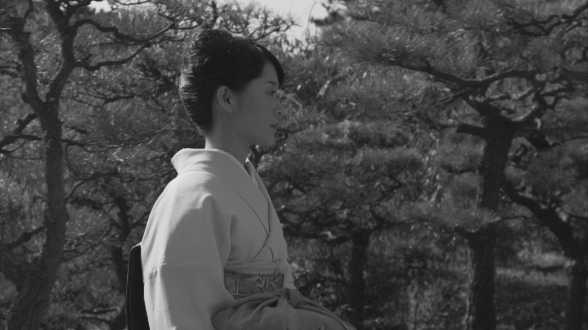
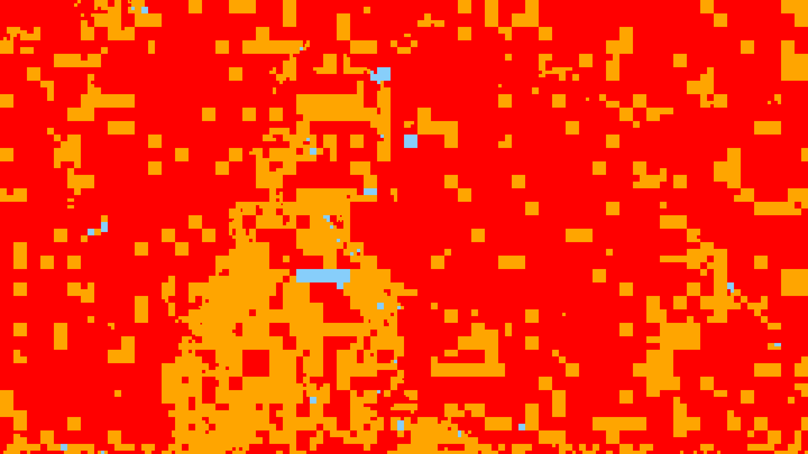
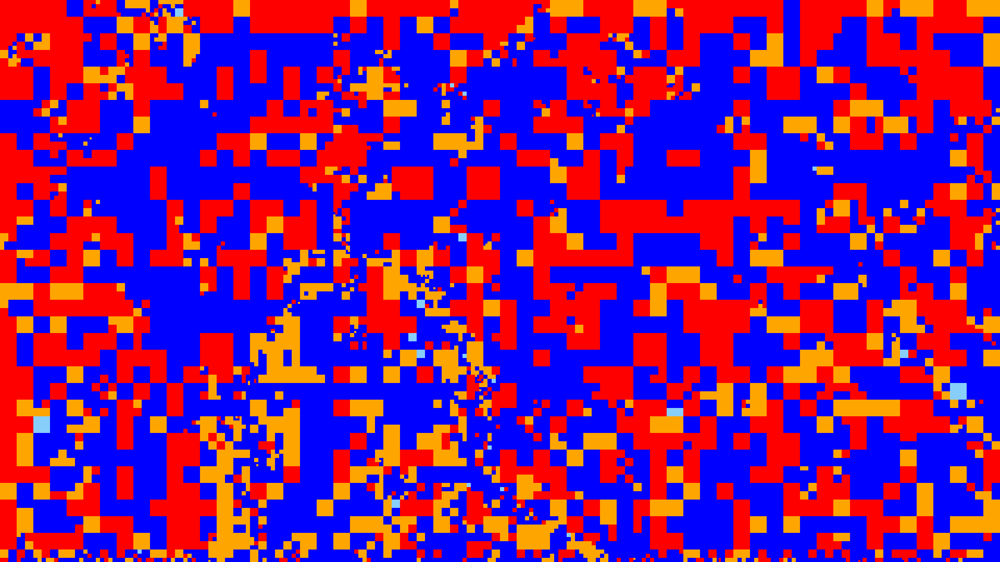

# Context-adaptive neural network based prediction for image compression

This repository is a Tensorflow implementation of the paper "Context-adaptive neural network based prediction for image compression", *TIP*, 2019.

[TIP 2019 paper](https://arxiv.org/abs/1807.06244) | [Project page with visualizations](https://www.irisa.fr/temics/demos/prediction_neural_network/PredictionNeuralNetwork.htm)

The code is tested on Linux and Windows.

## Prerequisites
  * Python (the code was tested using Python 2.7.9 and Python 3.5.4)
  * numpy (version >= 1.11.0)
  * tensorflow (optional GPU support), see [TensorflowInstallationWebPage](https://www.tensorflow.org/install/) (the code was tested using Tensorflow 1.4.2 and Tensorflow 1.5.1)
  * cython
  * matplotlib
  * pillow
  * scipy
  * six

## Cloning the code
Clone this repository into the current directory.
```sh
git clone https://github.com/thierrydumas/context_adaptive_neural_network_based_prediction.git
cd context_adaptive_neural_network_based_prediction
```

## Compilation
1. Compilation of the C++ code reproducing the HEVC/H.265 intra prediction modes via Cython.
   ```sh
   cd hevc/intraprediction
   python setup.py build_ext --inplace
   cd ../../
   ```
2. Compilation of HEVC/H.265 and two versions of HEVC/H.265 including the neural networks for intra prediction.
    * For Linux, refer to the documentation at "documentation_compilation_hevcs/linux/README.md".
    * For Windows, refer to the documentation at "documentation_compilation_hevcs/windows/README.md".
 
## Quick start: reproducing the main results of the paper
1. Creation of the Kodak test set containing 24 YCbCr images.
   ```sh
   python creating_kodak.py
   ```
2. Creation of the BSDS test set containing 100 YCbCr images. Below, "/path/to/dir_0" is the
   path to the directory storing the archive of the BSDS dataset the script "creating_bsds.py"
   downloads from [BSDSWebPage](https://www2.eecs.berkeley.edu/Research/Projects/CS/vision/bsds/).
   "/path/to/dir_1" is the path to the directory storing the RGB images extracted from this downloaded
   archive.
   ```sh
   python creating_bsds.py /path/to/dir_1 --path_to_directory_tar=/path/to/dir_0
   ```
3. Reproducing the results in Tables I, II, III, IV, and V. Note that the pretrained models of the
   neural networks for predicting blocks of size 4x4, 8x8, 16x16, and 32x32 are provided in the
   code. However, the pretrained models of the neural networks for predicting blocks of size 64x64
   are not given as their size is too large, which prevents from pushing them remotely. Please, either
   write to dumas--thierry@hotmail.fr to get the missing pretrained models or retrain them.
   ```sh
   python comparing_pnn_ipfcns_hevc_best_mode.py --all
   ```
4. Freezing the graphs and the parameters of the neural networks to use them inside HEVC/H.265 in Step 5.
   ```sh
   python freezing_graph_pnn.py --all
   ```
5. Reproducing the results in Tables IX and X. Below, "/path/to/dir_data" is the path
   to the directory storing the YUV sequence whose first frame is encoded and decoded
   via  HEVC/H.265 and two variants of HEVC/H.265 using the neural networks for intra
   predicton. "prefix" is the prefix of the name of this YUV sequence, e.g. "D_BasketballPass",
   "B_Kimono", "C_BasketballDrill" (CTC), "Bus" or "City" (xiph.org), see [XiphWebPage](https://media.xiph.org/video/derf/).
   ```sh
   python comparing_rate_distortion.py ycbcr --path_to_directory_data=/path/to/dir_data --prefix_filename=prefix
   ```
   
After running Step 3, the mean prediction PSNRs and the success rates of the neural
network for intra prediction in Tables I, II, III, IV, and V are stored in CSV files
in the directory at "pnn/visualization/checking_predictions/".

After running Step 5, the Bjontegaard's metrics in Tables IX and X and rate-distortion curves
are stored in the directory at "hevc/visualization/rate_distortion/".

## Quick start: training a neural network
1. Untaring the ILSVRC2012 training images. First of all, the ILSVRC2012 training images, "ILSVRC2012_img_train.tar"
   (137 GB), must be downloaded, see [ImageNetDownloadWebPage](http://image-net.org/download). Let's say that, in
   your computer, the path to "ILSVRC2012_img_train.tar" is "path/to/dir_0/ILSVRC2012_img_train.tar" and you want the
   unpacked images to be put into the directory at "path/to/dir_1",
   ```sh
   python untaring_ilsvrc2012_training.py path/to/dir_1 path/to/dir_0/ILSVRC2012_img_train.tar
   ```
2. Creating a training set for intra prediction. Let's say that you want to create a training set of pairs
   (luminance context, luminance 8x8 block to be predicted) and save it in the directory at "path/to/dir_2",
   ```sh
   python creating_training_set.py path/to/dir_1 path/to/dir_2 8 0
   ```
3. Training a neural network for intra prediction. As the training set of pairs (luminance context, luminance 8x8 block
   to be predicted) is ready, it is possible to train a neural network for predicting 8x8 luminance blocks from their
   context,
   ```sh
   python training_pnn.py path/to/dir_2 8 0 1.0 0.0 , 0 --is_fully_connected
   ```
   Please, see the complete documentation of "training_pnn.py" to understand its arguments.

## Visualizations
For a given luminance image, the command below creates the map of intra prediction modes
of HEVC and the maps of intra prediction modes of the two versions of HEVC including the
neural networks. The map of intra prediction modes of a luminance image corresponds to
the image quadtree partitioning, each luminance Transform Block (TB) being colored depending
on the intra prediction mode applied to it. Below "path/to/dir_data" is the path to the
directory storing the YUV sequence whose first frame is encoded via  HEVC/H.265 and two
variants of HEVC/H.265 using the neural networks for intra predicton. "prefix" is the
prefix of the name of this YUV sequence, e.g. "D_BasketballPass".
```sh
python comparing_maps_modes.py ycbcr path/to/dir_data prefix
```
<figure>
    <figure>
        
         <figcaption>(a)</figcaption>
    </figure>
    <figure>
        
         <figcaption>(b)</figcaption>
    </figure>
    <figure>
        
         <figcaption>(c)</figcaption>
    </figure>
    <figcaption>Maps of intra prediction modes: (a) luminance channel of the first frame of Kimono (1920x1080), (b)
    map of intra prediction modes of HEVC, and (c) map of intra prediction modes of the second variant of HEVC including
    the neural networks.</figcaption>
</figure>

## Citing
```
@article{context_adaptive_neural2019,
  author = {Dumas, Thierry and Roumy, Aline and Guillemot, Christine},
  title = {Context-adaptive neural network based prediction for image compression},
  journal = {arXiv preprint arXiv:1807.06244},
  year = {2019}
}
```


